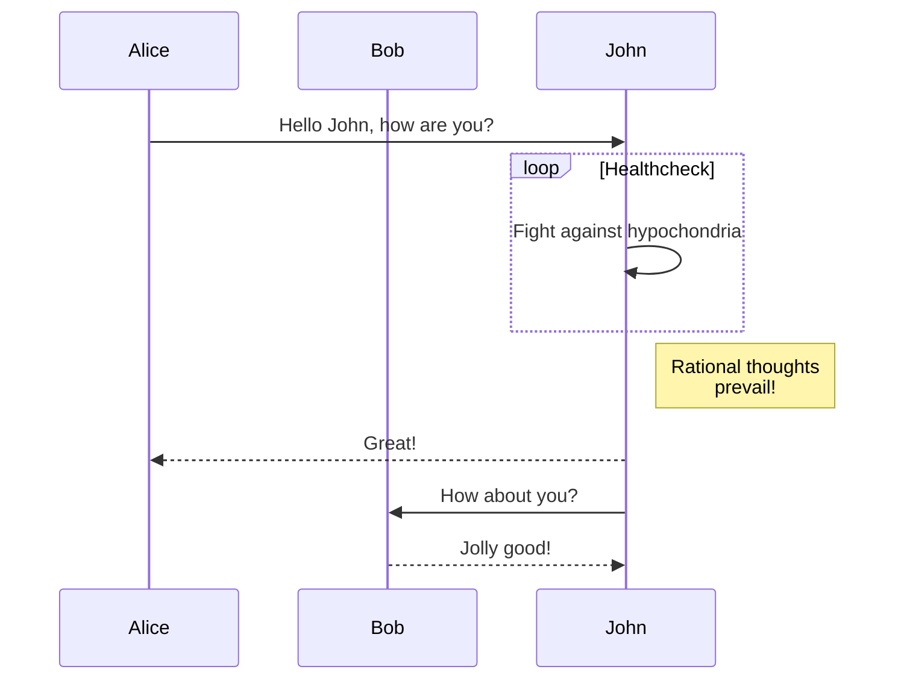

# Markdown

## ヘッダー

# h1 Heading
## h2 Heading
### h3 Heading
#### h4 Heading
##### h5 Heading
###### h6 Heading

## 強調されたテキスト
_テキストを強調する_

## 打ち消し線
~~打ち消し線~~

## 強い重要性
__強い重要性__

## 強調かつ強い重要性
___強調かつ強い重要性___

## リンク
### 名前付きリンク
[google](https://www.google.com/)

## テーブル
テーブルヘッダー1  | テーブルヘッダー2
------------- | -------------
テーブルコンテンツ1-1  | テーブルコンテンツ2-1
テーブルコンテンツ1-2  | テーブルコンテンツ2-2

## リスト
### 順序なしリスト
* 箇条書き1
  * 入れ子
    * 入れ子の入れ子
* 箇条書き2

### 順序付きリスト
<!-- 順序付きリストは入れ子にならなそう -->
1. 順序付き箇条書き1
  1. 入れ子1
  2. 入れ子2
2. 順序付き箇条書き2

## 引用
> 引用
>> 入れ子の引用

## 画像


## 水平線
---
## Mermaid




## URL
https://www.google.com/

## コード
<!-- 実際は半角スペース4つ不要 -->
    ``` js
    var foo = function (bar) {
      return bar++;
    };

    console.log(foo(5));
    ```

## 絵文字
:smile:

## 注釈
注釈1へのリンク[^first].

[^first]: 注釈1 **注釈もマークアップできる**

## テキストのハイライト
==ハイライト==

## チェックリスト
- [ ] 牛乳を買う
- [x] パンを買う

## 説明リスト
名前 1

:   定義1
定義1の改行

名前2 *名前のマークアッップ*

:   定義2

## ワーニング
::: warning
これは注意文言です
:::

## 目次
[toc]